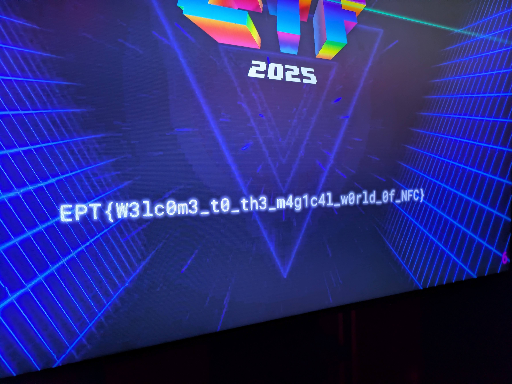
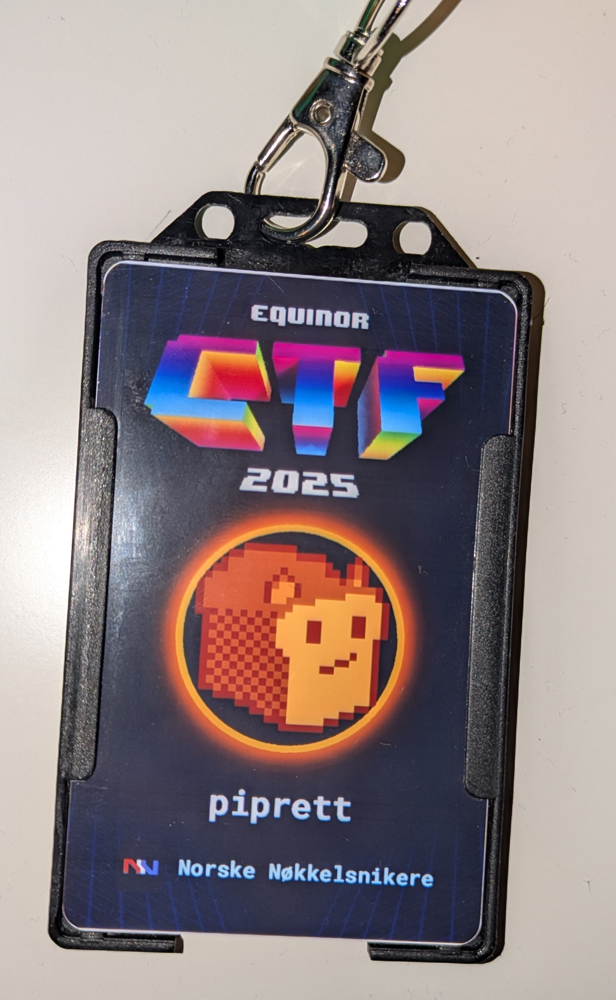

# 'Badge Flag' writeup

**Writeup author**: piprett (Norske Nøkkelsnikere)

The challenge is in the "sanity" category, so we can assume it will be very simple. Challenge description essentialy says what you need to do:

> There is an onsite Badge Decryptor where you can scan your badge and the flag will be displayed on the screen.

Everyone at the event had received an NFC badge prior to start, which was used for several challenges. Visiting the Badge Decryptor, we see a TV and a badge reader. To get the flag, put the badge on the reader for around one second. If you are quick it might not have read the badge fully, even if it beeps. The flag will be displayed on the TV after read.

`EPT{W3lc0m3_t0_th3_m4g1c4l_w0rld_0f_NFC}`

|                                        |                                  |
| -------------------------------------- | -------------------------------- |
|  |  |
