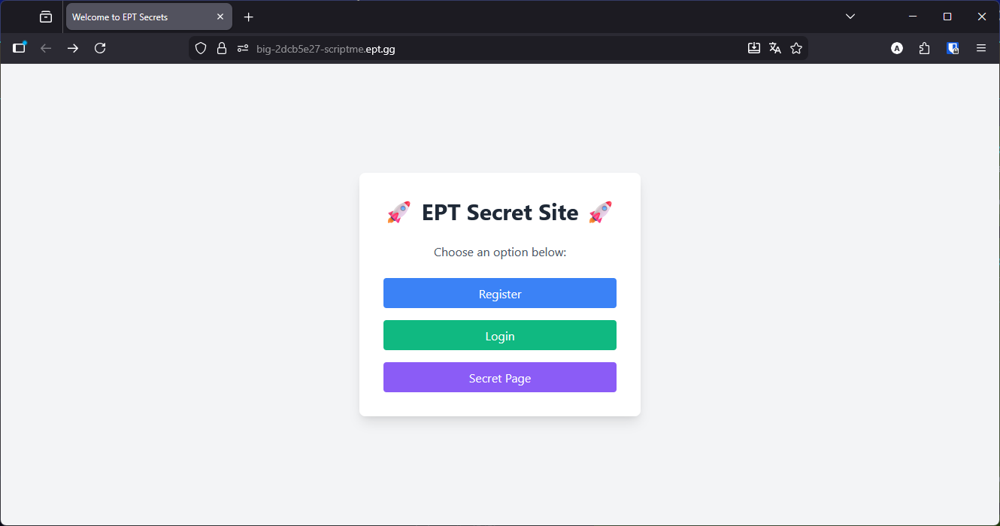
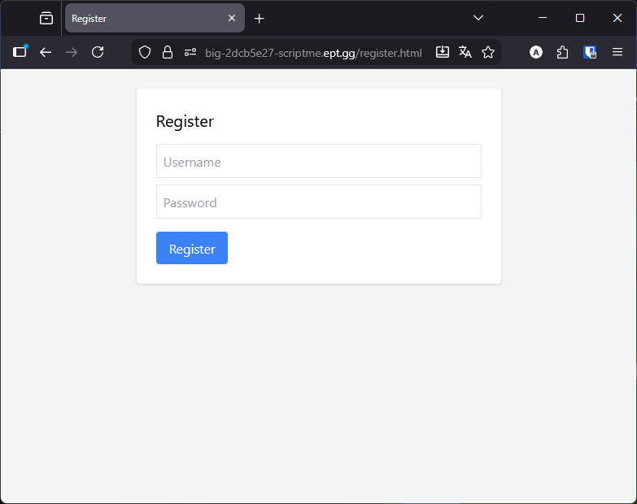
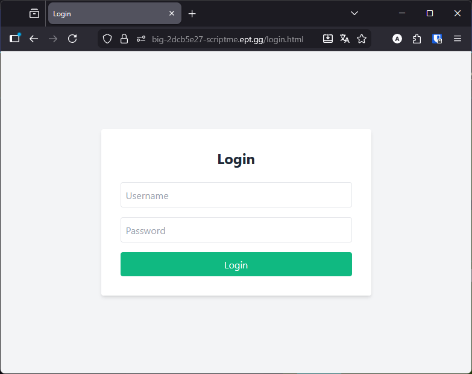
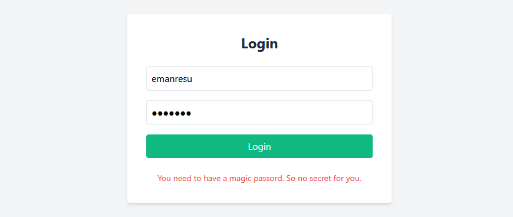
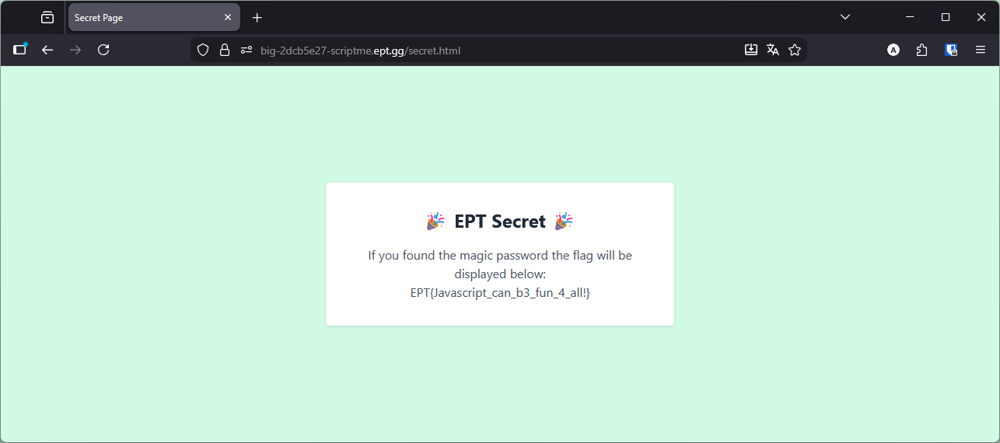

# Writeup: ScriptMe

**Team:** big🔥

**Author:** Jyggorath

**Flag:** `EPT{Javascript_can_b3_fun_4_all!}`

## The target

In this challenge we are presented with a link to the target site. No source code for download, only the hint *"Sometimes you need to look at what is going on in the browser to find a flag."*

The page itself is very simple. A registration page, a login page, and a mysterious "Secret Page" which simply redirects us to the login page.



| Register page                              | Login page                           |
| :----------------------------------------: | :----------------------------------: |
|  |  |

Registering a user and attempting to login with it gets us nowhere, as we need a specific password for it to work:



## Expected key

Looking at the source of the page, we find Javascript which handles the login flow. If the credentials used are valid, it will fetch a value from `/key` and compare it to the password that the user gives:

```javascript
try {
	const res = await fetch('/login', {
		method: 'POST',
		headers: {
			'Content-Type': 'application/x-www-form-urlencoded',
		},
		body: `username=${encodeURIComponent(username)}&password=${encodeURIComponent(password)}`
	});

	if (res.status === 200) {
		const keyres = await fetch('/key', {
			method: 'GET',
			headers: {
				'Content-Type': 'application/x-www-form-urlencoded',
			}
		});
		const key = await keyres.text();
		const expectedKey = toBase64(password.trim());
		// Set the cookie manually (if server didn't set one)
		if (key.trim() === expectedKey ) {
			document.cookie = 'magic=' + expectedKey + '; path=/';
		} else {
			document.getElementById('nokey').classList.remove('hidden');
			return;
		}
		window.location.href = '/secret.html';
	} else {
		document.getElementById('errorMsg').classList.remove('hidden');
	}

} catch (err) {
	console.error('Login failed', err);
	document.getElementById('errorMsg').classList.remove('hidden');
}
```

If the password matches the key, it sets it in a cookie and redirects us to `/secret.html`.

So let's try to get the key and see what it is:

```
$ curl https://big-2dcb5e27-scriptme.ept.gg/key
VGhpcyBpcyB0aGUgbWFnaWMgcGFzc3dvcmQh
```

Let's pipe that to base64 decryption to see what the key actually is:

```
$ curl https://big-2dcb5e27-scriptme.ept.gg/key | base64 -d
  % Total    % Received % Xferd  Average Speed   Time    Time     Time  Current
                                 Dload  Upload   Total   Spent    Left  Speed
100    36  100    36    0     0    145      0 --:--:-- --:--:-- --:--:--   145
This is the magic password!
```

So the expected password simply is `This is the magic password!`

The rest is simple. We need to register a user with this password first, as the check will only happen if the user is valid. After that, we can use the new user with the magic password on the login page, and we will be able to see `/secret.html`:

